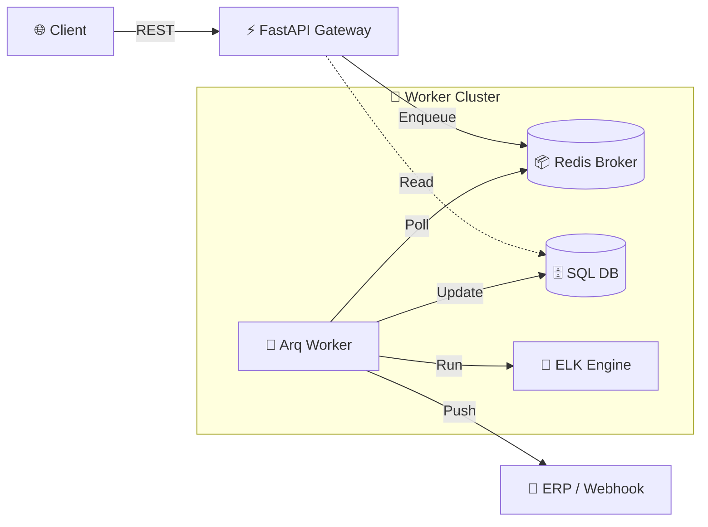
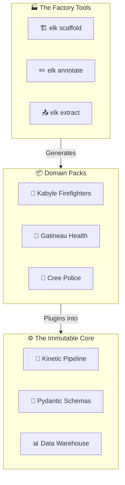
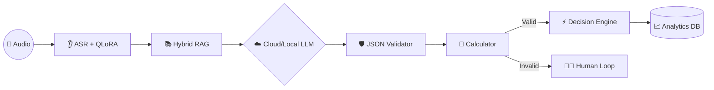

# 🚨 Emergency Lang Kit (ELK)

**Research prototype for multilingual emergency-call analysis.** The repository explores asynchronous audio ingestion, transcription adapters and structured incident extraction. It does not establish production readiness or validated real-world model performance.

> **Asynchronous AI Kernel for Emergency Call Analysis**  \


[](LICENSE)
[](pyproject.toml)
[]()
[]()
[](CONTRIBUTING.md)

---

## 🌍 The Mission

In high-stakes emergency situations, every second counts. Language barriers (dialects like Kabyle or Arabizi) and high call volume can cripple existing systems. 

**ELK (Emergency Lang Kit)** is a modular, decentralized AI kernel designed to:
1.  **Transcription & Translation**: experiment with multilingual audio-processing adapters.
2.  **Structured Extraction**: validate model output against schemas. Schema validation checks format; it does not guarantee factual correctness or model accuracy.
3.  **Integration**: explore asynchronous delivery of structured information through connectors and webhooks.

> **"Decentralizing Emergency Intelligence to save lives through modular AI."**

---

## 🛡️ Hardening Résumé

Actions mises en place pour sécuriser et rendre l’ingestion plus robuste :
- **Sécurité** : Auth par `X-API-Key` (configurable), CORS/AllowedHosts restreints.
- **Résilience** : Backpressure sur Redis (`MAX_QUEUE_SIZE` + 429), timeouts d’accès queue.
- **Traçabilité** : `correlation_id` propagé API → worker → connector.
- **Validation** : Contrôle base64/MIME avant écriture disque, limite de taille, nettoyage TTL en tâche de fond.
- **Ops** : Docker non-root (`elkuser`), health check étendu (Redis/DB), script de démo prêt.

---

## 📐 Architecture

ELK implements an asynchronous ingestion pipeline with a FastAPI gateway, Redis queue and background workers. Throughput and production reliability require separate measurement and validation.


```mermaid
graph LR
    Client["🌐 Client"] -->|REST| API["⚡ FastAPI Gateway"]
    API -->|Enqueue| Redis[("📦 Redis Broker")]
    API -.->|Read| DB[("🗄️ SQL DB")]

    subgraph Workers["👷 Worker Cluster"]
        Worker["🔄 Arq Worker"] -->|Poll| Redis
        Worker -->|Update| DB
        Worker -->|Run| Pipeline["🧠 ELK Engine"]
    end

    Worker -->|Push| ERP["🏢 ERP / Webhook"]
```

### Key Components
- **FastAPI Gateway**: stateless audio-ingestion API.
- **Arq Workers**: Distributed task execution with built-in retry logic.
- **SQLModel Orchestrator**: Real-time job state tracking and performance metrics.
- **ELK Engine**: Multi-modal pipeline (Whisper + Gemini + RAG).

### Functional Topology


```mermaid
graph TD
    subgraph KERNEL["⚙️ The Immutable Core"]
        Pipeline["🔀 Kinetic Pipeline"]
        Ontology["📐 Pydantic Schemas"]
        Analytics["📊 Data Warehouse"]
    end

    subgraph FACTORY["🏭 The Factory Tools"]
        Scaffold["🏗️ elk scaffold"]
        Annotate["✏️ elk annotate"]
        Extract["📤 elk extract"]
    end

    subgraph PACKS["📦 Domain Packs"]
        P1["🚒 Kabyle Firefighters"]
        P2["🏥 Gatineau Health"]
        P3["👮 Cree Police"]
    end

    FACTORY -- "Generates" --> PACKS
    PACKS -- "Plugins Into" --> KERNEL
```

### Processing Pipeline (Audio → Structured Information)


```mermaid
graph LR
    A(("🎤 Audio")) --> B["👂 ASR + QLoRA"]
    B --> C["📚 Hybrid RAG"]
    C --> D{"☁️ Cloud/Local LLM"}
    D --> E["🛡️ JSON Validator"]
    E --> F["🧮 Calculator"]
    F -- Valid --> G["⚡ Decision Engine"]
    F -- Invalid --> H["👨‍🚒 Human Loop"]
    G --> I[("📈 Analytics DB")]
```

---

## 🛠️ Tech Stack

- **Backend**: Python 3.10, FastAPI, SQLModel.
- **Queue**: Redis, Arq (Asynchronous Distributed Tasks).
- **AI/ML**: WhisperX (ASR), LLM (Gemini), ChromaDB (Vector Search).
- **Ops**: Docker, Docker Compose; lint/format/type tooling (ruff/black/mypy).

---

## 🏗️ Quick Start

### Prerequisites
- Docker & Docker Compose

### Run the Stack
```bash
docker-compose up --build
```
This spins up:
- **ELK API**: `http://localhost:8000`
- **Redis Broker**: `localhost:6379`
- **Worker Node**: Background processor (Scale with `docker-compose up --scale elk-worker=3`)

### Test the Pipeline
```bash
# Submit a transcription job (JSON/Base64)
# Encoded dummy WAV: "UklGRiAAAABXQVZFRm10IBAAAAABAAEAQB8AAEAfAAABAAgAZGF0YQAAAAA="
curl -X POST "http://localhost:8000/jobs" \
  -H "Content-Type: application/json" \
  -H "X-API-Key: your_secure_key" \
  -d '{
    "audio_base64": "UklGRiAAAABXQVZFRm10IBAAAAABAAEAQB8AAEAfAAABAAgAZGF0YQAAAAA=",
    "language_hint": "kab"
  }'
```

---

## 📈 Roadmap & Prochaines Étapes

Pour passer d’un prototype durci à une posture “prod” :
- **Identity & Access** : OIDC/mTLS, rate limiting/quotas côté edge.
- **Observabilité** : OTel + métriques Prometheus (latence, queue depth, retries, états jobs) + alerting.
- **Data Lifecycle** : Dead Letter Queue, idempotence des jobs/connectors.
- **HA** : Redis/DB en HA, déploiement K8s avec HPA basé sur la profondeur de queue.
- **Governance** : Hash/signature des packs/modèles, validation au démarrage, chiffrement des secrets/PII.

---

## 🧪 Verification & Demo

Le projet inclut une suite de tests automatisés et un script de démonstration pour valider le durcissement :

### Run Tests (Local)
```bash
python -m pytest tests/test_security_backpressure.py tests/test_api.py
```
*Consultez [docs/TEST_RESULTS.md](docs/TEST_RESULTS.md) pour les preuves d'exécution.*

### API Demo
Un script client est disponible pour tester l'API avec authentification :
```bash
# Nécessite un serveur ELK actif (docker-compose up)
python tools/demo_request.py
```

---

## 📂 Repository Structure

- `elk/api` - Stateless FastAPI Gateway.
- `elk/workers` - Async Task Processors (Arq).
- `elk/engine` - The AI Kernel core (Whisper, LLM, RAG).
- `elk/connectors` - Enterprise integration layer.
- `packs/` - Domain-specific language/rule configuration.
- `docs/` - Comprehensive technical documentation.

---

## 🤝 Contributing & License

We value professional workflow! Please check [CONTRIBUTING.md](CONTRIBUTING.md) for pull request guidelines.

Licensed under the [MIT License](LICENSE).

---
**Author:** RayanTR  
*Building robust AI systems for real-world impact.*
