# 🚀 Emergency Lang Kit: The Complete Vision
## "The WordPress of Emergency AI — A Modular Platform for Certified Intelligence"

> **Purpose:** This document consolidates EVERY idea discussed for the ELK project.
> **Target:** Technical Directors seeking an enterprise-grade, scalable AI solution.

---

# PART 1: THE CORE IDEA

## 1.1 The Problem We Solve
Emergency calls are a data goldmine that is currently **wasted**.
*   **Language Chaos:** Callers speak dialects (Kabyle, Arabizi, Cree). Standard tools fail.
*   **No Memory:** Once the call ends, the intelligence is lost. Only the dispatch action is saved.
*   **Zero Scalability:** Building a custom AI for each dialect costs millions.

## 1.2 Our Solution: The "Factory" Model
We don't just build one AI. We build **the factory that makes AIs**.
*   **Kernel:** A core engine that is language/domain agnostic.
*   **Packs:** Swappable bundles (Language + Rules + Knowledge).
*   **Tools:** No-Code utilities for the community to build packs.

```mermaid
graph TD
    subgraph KERNEL["⚙️ The Immutable Core"]
        Pipeline[Kinetic Pipeline]
        Ontology[Pydantic Schemas]
        Analytics[Data Warehouse]
    end

    subgraph FACTORY["🏭 The Factory Tools"]
        Scaffold[elk scaffold]
        Annotate[elk annotate]
        Extract[elk extract]
    end

    subgraph PACKS["📦 Domain Packs"]
        P1[Kabyle Firefighters]
        P2[Gatineau Health]
        P3[Cree Police]
    end

    FACTORY -- "Generates" --> PACKS
    PACKS -- "Plugins Into" --> KERNEL
```



---

# PART 2: THE CORE ENGINE (Technical Deep Dive)

## 2.1 The 5-Stage Pipeline

```mermaid
graph LR
    A((Audio)) --> B[👂 ASR + QLoRA]
    B --> C[📚 Hybrid RAG]
    C --> D{☁️/💻 Cloud/Local LLM}
    D --> E[🛡️ JSON Validator]
    E --> F[🧮 Calculator]
    F -- Valid --> G[⚡ Decision Engine]
    F -- Invalid --> H[👨‍🚒 Human Loop]
    G --> I[(🗄️ Analytics DB)]
```



### Stage A: ASR (The Ears)
*   **Model:** OpenAI Whisper.
*   **Innovation:** QLoRA Adapters for dialects. Small file (~100MB), hot-swappable.

### Stage B: RAG (The Context)
*   **Standard:** Vector search (ChromaDB).
*   **Upgrade (Proposed):** **Hybrid Search** = `BM25 (Keyword)` + `Vector`. Essential for proper nouns (street names).

### Stage C: LLM (The Brain)
*   **Hybrid Mode:** Switch via `config.yaml`.
    *   **Cloud:** GPT-4 / Claude (High Performance).
    *   **Local:** Llama 3 via Ollama (Privacy / Air-Gapped).

### Stage D: Validator (The Judge)
*   **Rule:** LLM output MUST be pure JSON matching `core/interfaces.py`.
*   **No Markdown.** No "I think...". Just data.

### Stage E: Calculator (The Scorer)
*   `confidence = w1*asr_score + w2*entity_match_score + w3*rag_hit_score`
*   If `confidence < 0.7`, trigger Human-in-the-Loop.

---

# PART 3: DOMAIN PACKS (The Scalability Engine)

A "Pack" is a **No-Code** bundle that configures ELK for a specific vertical.

## 3.1 Pack Structure

```text
packs/kabyle-civil-protection/
├── config.yaml         # LLM settings, thresholds
├── lexicon.yaml        # Translations: "Fire" = "Times"
├── geography.json      # GeoJSON of Communes/Quartiers
├── rules.yaml          # Decision Logic
├── prompts/
│   └── extraction.md   # Specialized system prompts
└── models/
    └── whisper-kab.bin # QLoRA adapter
```

## 3.2 Pack Examples

| Pack Name                  | Domain         | Language           |
| :------------------------- | :------------- | :----------------- |
| `dz-civil-protection`      | Firefighters   | Kabyle / Arabizi   |
| `ca-gatineau-health`       | Medical Triage | French / English   |
| `ca-first-nations-police`  | Policing       | Cree / Ojibwe      |

---

# PART 4: THE FACTORY TOOLS (Community Enablement)

## 4.1 Tool: `elk scaffold`
Creates the folder structure for a new pack.
```bash
elk scaffold --name="my-new-pack"
# -> Creates packs/my-new-pack/ with templates
```

## 4.2 Tool: `elk extract` (The Knowledge Refinery)
Ingests PDFs (Manuals) to generate `rules.yaml` and `lexicon.yaml`.

```mermaid
graph LR
    PDF[📄 PDF Manual] --> Chunk[Chunker]
    Chunk --> LLM[LLM Extraction]
    LLM --> Candidate[Candidate YAML]
    Candidate --> Human{👨‍🔬 Human Review}
    Human -- Approve --> Final[rules.yaml]
    Human -- Reject --> LLM
```



## 4.3 Tool: `elk annotate` (The Data Engine)
Streamlit UI for creating ASR training data.
*   **Workflow:** Play Audio -> Correct Transcript -> Fix Entities -> Save.
*   **Output:** High-quality JSONL for QLoRA fine-tuning.

## 4.4 Tool: `elk train` (The Fine-Tuning Script)
**"The Automated MLOps Pipeline"**
We don't want users messing with PyTorch code. We provide a wrapped trainer.

*   **Technology:** **Unsloth** (2x faster, 60% less memory). Allows training on Colab Free Tier (T4 GPU).
*   **Command:** `elk train --lang=kab --dataset=./data/validated.jsonl`
*   **The Script Logic:**
    1.  Load Base Model (Whisper Large V3).
    2.  Load LoRA Config (`r=16, alpha=32`).
    3.  Load Dataset (Automatic formatting from `elk annotate`).
    4.  **Train** (1-2 hours for 1000 samples).
    5.  **Export:** Saves `adapter.bin` to `packs/kabyle/models/`.

## 4.5 The Training Database (Dataset Versioning)
We don't just dump files. We structure the training data to avoid "Catastrophic Forgetting".

```mermaid
graph TD
    Raw[🎙️ Raw Audio] --> Annotate[elk annotate]
    Annotate --> DB[(🗄️ Training.db (SQLite))]
    DB --> Filter{Select High Quality}
    Filter --> Train[🏋️ Training Set (80%)]
    Filter --> Eval[🧪 Test Set (20%)]
    Train --> Unsloth[🚀 Unsloth QLoRA]
    Unsloth --> Model[📦 Adapter.bin]
```

*   **Database Schema:**
    *   `audio_hash` (Primary Key)
    *   `transcription_golden` (Human Validated)
    *   `dialect_tags` (e.g., "Tichy Accent")
    *   `is_test_set` (Boolean)

---

# PART 5: ANALYTICS & INTELLIGENCE

## 5.1 Data Warehouse
We log **everything**, not just the dispatch.
*   `calls.jsonl`: Timestamp, Duration, Audio Hash.
*   `decisions.jsonl`: Incident, Action, Reasoning Trace.
*   `geolocation.jsonl`: Lat/Lon of every call.

## 5.2 Use Cases
*   **KPI Dashboard:** "Average confidence score this week".
*   **Heatmaps:** "Where are drownings happening in July?"
*   **Predictive Alerting:** "Pre-position an ambulance at Tichy beach on Fridays".

---

# PART 6: PROPOSED ARCHITECTURAL UPGRADES

## 6.1 Event-Driven Architecture (EDA)
*   **Current:** Synchronous pipeline. Slow.
*   **Upgrade:** Publish/Subscribe model (Redis/Kafka).
    *   `AudioTranscribed` event -> consumed by Analytics, Decision, Logging *in parallel*.

## 6.2 Docker Compose (Air-Gapped Deployment)
```yaml
# docker-compose.yml (Proposed)
services:
  elk-core:
    image: elk:latest
  elk-vectordb:
    image: chromadb/chroma
  elk-llm:
    image: ollama/ollama
```
*   Deploy the entire stack on an offline server in a remote fire station.

---

# SUMMARY: The Value Proposition for Enterprise

| Feature                 | What it proves                                  |
| :---------------------- | :---------------------------------------------- |
| **Factory Model**       | Scalability. One codebase, infinite verticals.  |
| **QLoRA Adapters**      | Low-Resource NLP expertise.                     |
| **Hybrid RAG**          | State-of-the-art retrieval knowledge.           |
| **Cloud/Local Toggle**  | Enterprise deployment flexibility.              |
| **Strict JSON**         | Determinism. No hallucinations.                 |
| **Analytics Layer**     | Data Engineering + BI skills.                   |
| **Docker Air-Gap**      | Security-conscious, production-ready mindset.   |
