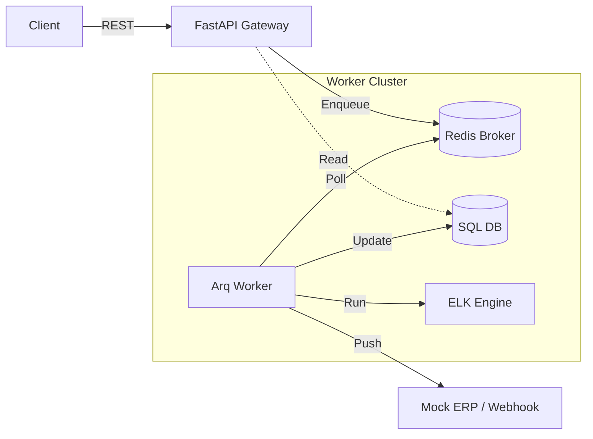

```mermaid
graph LR
    Client -->|REST| API[FastAPI Gateway]
    API -->|Enqueue| Redis[(Redis Broker)]
    API -.->|Read| DB[(SQL DB)]

    subgraph "Worker Cluster"
        Worker[Arq Worker] -->|Poll| Redis
        Worker -->|Update| DB
        Worker -->|Run| Pipeline[ELK Engine]
    end

    Worker -->|Push| ERP[Mock ERP / Webhook]
```
