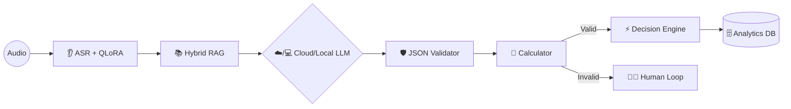

```mermaid
graph LR
    A((Audio)) --> B["👂 ASR + QLoRA"]
    B --> C["📚 Hybrid RAG"]
    C --> D{"☁️/💻 Cloud/Local LLM"}
    D --> E["🛡️ JSON Validator"]
    E --> F["🧮 Calculator"]
    F -- Valid --> G["⚡ Decision Engine"]
    F -- Invalid --> H["👨‍🚒 Human Loop"]
    G --> I[("🗄️ Analytics DB")]
```
