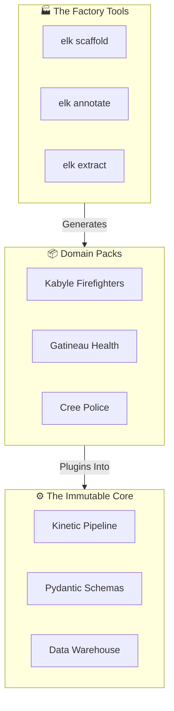

```mermaid
graph TD
    subgraph KERNEL["⚙️ The Immutable Core"]
        Pipeline[Kinetic Pipeline]
        Ontology[Pydantic Schemas]
        Analytics[Data Warehouse]
    end

    subgraph FACTORY["🏭 The Factory Tools"]
        Scaffold[elk scaffold]
        Annotate[elk annotate]
        Extract[elk extract]
    end

    subgraph PACKS["📦 Domain Packs"]
        P1[Kabyle Firefighters]
        P2[Gatineau Health]
        P3[Cree Police]
    end

    FACTORY -- "Generates" --> PACKS
    PACKS -- "Plugins Into" --> KERNEL
```
